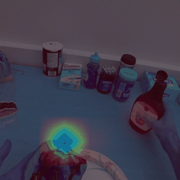
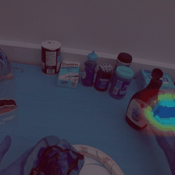

# Machine Learning and Deep Learning Project on First Person Action Recognition

The project consisted in exploring the state of the art in first person action recognition as well as proposing our own variation to the analysed architectures. Concerning our variation, we embraced the Computer Vision recent research trend of replacing the convLSTM (largely used in First Person Action Recognition) with the transformer architecture following the great success achieved in Natural Language Processing.

The project was developed using PyTorch by Gennaro Petito, Gioele Scaletta and Andrea Parolin as part of the course Machine Learning and Deep Learning taught by Professor Barbara Caputo.

The paper explaining our project is available [here](https://github.com/gioele-scaletta/ML-DL-FPAR/blob/main/variation/project_paper.pdf)

This git contains the source code associated with our project, built upon the papers:

* ["Attention is All We Need: Nailing Down Object-centric Attention for Egocentric Activity Recognition"](https://arxiv.org/pdf/1807.11794.pdf)
* ["Self-Supervised Joint Encoding of Motion and Appearance for First Person Action Recognition"](https://arxiv.org/pdf/2002.03982.pdf)

## Architecure

## Visualization of the CAM improvement with and without the self-supervised task
RGB Attention  |  SS_Task
:-------------------------:|:-------------------------:
| 

## Note
- main_new_transformer.py is for concatenated CAM and predited motion maps.
- main_transformer_two_stages.py is without concatenation, with and without the self-supervised task.

## Comparison with 7 frames
 **Configurations**            | **MParams** | **GMACS** | **Accuracy (%)** 
-------------------------------|-------------|-----------|------------------
 ConvLSTM SS\-regression       | 40\.73      | 32\.17    | 68\.1            
 Transformer CAM attention     | 51\.23      | 25\.75    | 65\.51           
 Transformer concat SS and CAM | 57\.15      | 25\.79    | 59\.48    
