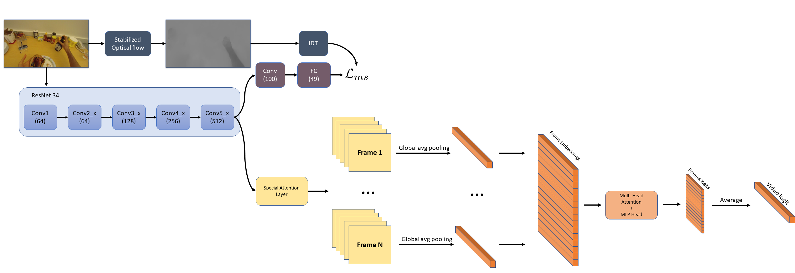

# Machine Learning and Deep Learning Project on First Person Action Recognition

This git contains the source code associated with our project, built upon the papers: 
["Attention is All We Need: Nailing Down Object-centric Attention for Egocentric Activity Recognition"](https://arxiv.org/pdf/1807.11794.pdf)  
["Self-Supervised Joint Encoding of Motion and Appearance for First Person Action Recognition"](https://arxiv.org/pdf/2002.03982.pdf) 
The variation we propose is to replace the ConvLSTM, which is largely used in First Person Action Recognition, with a transformer, that has had a great success in Natural Language Processing, and now is being explored as an option in Computer Vision. The paper is available [here](https://github.com/gioele-scaletta/ML-DL-FPAR/blob/main/variation/project_paper.pdf)

## Architecure of the proposed variation

## Visualization of the CAM improvement with and without the self-supervised task
